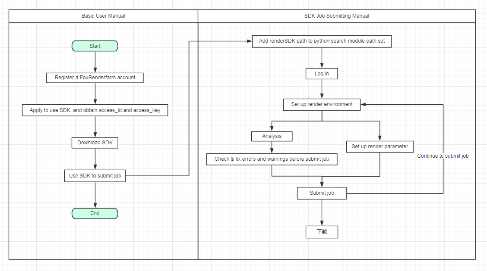

## <center> Python Render SDK(Local Analysis Version) </center>


### 1: About RenderSDK
    We are providing an easily executing Python-based RenderSDK to apply with our cloud rendering service.
    This is the official version of RenderSDK maintained by the Fox Render Farm / Renderbus RD&TD team.
    The SDK has been tested with python 2.7.10 and python 3.4.4.


#### Supported software
- [x] Maya
- [x] 3ds Max
- [x] Houdini
- [x] Katana
- [x] Cinema 4d
    
    
### 2: RenderSDK user guide


**Attention:**

    1. A Rayvision account is required for starters
    2. You need to apply for the RenderSDK and obtain the access_id and access_key to log in. 
    3. Download RenderSDK
    4. Submit jobs follow the routine


**User guide:**





### 3: Sample code


```
#!/usr/bin/env python
# -*- coding:utf-8 -*-
"""
Sample code 1: If calling Rayvision analysis routine 
"""

import sys

renderSDK_path = r'D:\gitlab\renderSDK'
sys.path.append(renderSDK_path)

from renderSDK.Rayvision import Rayvision

# 1.Log in
rayvision = Rayvision(domain_name='task.renderbus.com', platform='2', access_id='xxx', access_key='xxx', workspace='c:/renderfarm/sdk_test')

# 2. Set up render environment（Plug-in settings、Project settings）
job_id = rayvision.set_render_env(cg_name='Maya', cg_version='2016', plugin_config={}, label_name='dasdd')

# 3.Analysis
scene_info_render, task_info = rayvision.analyse(cg_file=r'D:\gitlab\renderSDK\scenes\TEST_maya2016_ocean.mb')

# 4. Manually check errors and cautions before proceeding.
error_info_list = rayvision.check_error_warn_info()

# 5. Job submit（Job parameters can be changed）
scene_info_render_new = scene_info_render
task_info_new = task_info
rayvision.submit_job(scene_info_render_new, task_info_new)

# 6. Download
rayvision.auto_download(job_id_list=[job_id], local_dir=r"c:/renderfarm/sdk_test/output")
# rayvision.auto_download_after_job_completed(job_id_list=[job_id], local_dir=r"c:/renderfarm/sdk_test/output")

```


```
#!/usr/bin/env python
# -*- coding:utf-8 -*-
"""
Sample code 2：If not calling Rayvision analysis routine
"""

import sys

renderSDK_path = r'D:\gitlab\renderSDK'
sys.path.append(renderSDK_path)

from renderSDK.Rayvision import Rayvision

# 1. Log in
rayvision = Rayvision(domain_name='task.renderbus.com', platform='2', access_id='xxx', access_key='xxx', workspace='c:/renderfarm/sdk_test')

# 2. Set up render environment（Plug-in settings、Project settings）rayvision.set_job_config(cg_name='Maya', cg_version='2016', plugin_config={})
job_id = rayvision.set_render_env(cg_name='Maya', cg_version='2016', plugin_config={}, label_name='dasdd')

# 3.Set up render parameter(see docs)
scene_info_render = {}
task_info = {}
upload_info = {}

# 4.Job submit
rayvision.submit_job(scene_info_render, task_info, upload_info)

# 5. Download
rayvision.auto_download(job_id_list=[job_id], local_dir=r"c:/renderfarm/sdk_test/output")
# rayvision.auto_download_after_job_completed(job_id_list=[job_id], local_dir=r"c:/renderfarm/sdk_test/output")
```


### 4: Method Analysis


---


#### 1. Log in


```
rayvision = Rayvision(domain_name='task.renderbus.com', platform='2', access_id='xxx', access_key='xxx', workspace='c:/renderfarm/sdk_test')
```


**Parameter:**<br/>


Parameter | Type | Value | Instruction
---|---|---|---
domain_name | str | task.foxrenderfarm.com, task.renderbus.com | 
platform | str | 2, 8, 9, 10 | platform
access_id | str | xxx | 
access_key | str | xxx | 
workspace | str |  | If not set up, the default path of SDK(configuration files and log files saving path) is under workspace catalogue


**Return:**<br/>


Rayvision’s object, may use this object to call other methods


---


#### 2. Set up job configuration（Plug-in settings、Project settings）


```
job_id = rayvision.set_render_env(cg_name='Maya', cg_version='2016', plugin_config={}, label_name='dasdd')
```


**Parameter:**<br/>


Parameter | Type | Value | Instruction
---|---|---|---
cg_name | str | Maya, 3ds Max, Houdini | Spelling is case sensitive
cg_version | str | 2014, 2015 ... | 
plugin_config | dict | {"fumefx":"4.0.5", "redshift":"2.0.76"} | No need to fill in if no plug-in is setting up
edit_name | str | hello | Plug-in configuration name, which represents the plug-in configuration 
label_name | str | defaultProject | Setting is optional, indicate the belonged job project 


**Return:**<br/>


Parameter | Type | Value | Instruction
---|---|---|---
job_id | str |  | Job id


---


#### 3. Analysis


```
scene_info_render, task_info = rayvision.analyse(cg_file=r'D:\gitlab\renderSDK\scenes\TEST_maya2016_ocean.mb')
```


**Parameter:**<br/>


Parameter | Type | Value | Instruction
---|---|---|---
cg_file | str |  | Scene path
project_dir | str |  | Setting is optional, project catalogue(if setting up, just detect according asset files required for rendering in your project catalogue)  


**Return:**<br/>


Parameter | Type | Value | Instruction
---|---|---|---
scene_info_render | dict |  | The analyzed scene parameters（for rendering）, able to edit task_info | dict |  | Job parameter(for rendering), can be edited 


---


#### 4. Manually check errors and cautions before proceeding


```
error_info_list = rayvision.check_error_warn_info()
```


**Parameter:**<br/>


Parameter | Type | Value | Instruction
---|---|---|---
language | str | '0' | 0: chinese 1: English


**Return:**<br/>


Parameter | Type | Value | Instruction 
---|---|---|---
error_info_list | list |  | Manually check & fix errors and cautions before proceeding（If errors and alert occurred, SDK is not able to be proceeded）


---


#### 5.Job submit（Job parameter can be edited）


```
scene_info_render_new = scene_info_render
task_info_new = task_info
rayvision.submit_job(scene_info_render_new, task_info_new, max_speed=100)
```


**Parameter:**<br/>


Parameter | Type | Value | Instruction 
---|---|---|---
scene_info_render | dict |  | Scene parameter(for rendering)
task_info | dict |  | Job parameter(for rendering)
max_speed | int | 100 | Upload speed limit.Default value is 1048576 KB/S, means 1 GB/S


**Return:**<br/>


True


---


#### 6.Download


```
rayvision.auto_download(job_id_list=[job_id], local_dir=r"c:/renderfarm/sdk_test/output")
# rayvision.auto_download_after_job_completed(job_id_list=[job_id], local_dir=r"c:/renderfarm/sdk_test/output")
```


**Parameter:**<br/>


Parameter | Type | Value | Instruction 
---|---|---|---
job_id_list | list<int> |  | Job id list
local_dir | str |  | Local download
max_speed | int | 100 | Download speed limit.Default value is 1048576 KB/S, means 1 GB/S
print_log | bool | True | Whether to display the download command line. True: display; False: not display
sleep_time | int/float | 10 | Sleep time between download, unit is second


**Return:**<br/>


True

